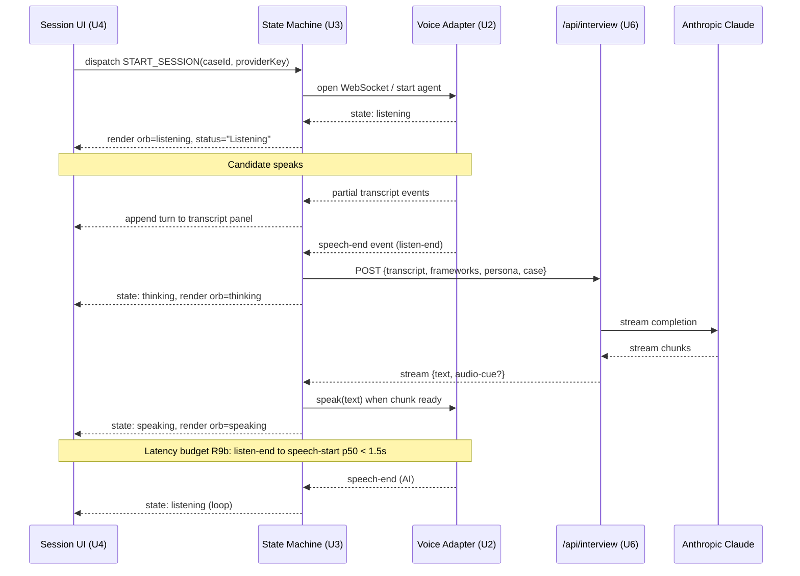

# feat: PM Interview Voice Agent (Mockingbird) V1

## Summary

Implement V1 of Mockingbird as a Next.js 14+ App Router application on Vercel with Tailwind + TypeScript, structured around a capability-tiered voice provider abstraction (Cartesia / Sarvam / ElevenLabs), a reduce-based voice session state machine with explicit error states, a three-panel session UI, server-side Anthropic Claude as the interviewer LLM (with framework-aware probes), a BYO-API-key onboarding flow with sessionStorage-default storage, and a marketing homepage with mobile interstitial. Nine implementation units across four phases. V0 bakeoff content is excluded — operator deliverable per origin.

---

## Problem Frame

The product, motivation, and audience are defined in the origin requirements doc — see Sources & References. This plan's contribution is the technical execution: how the requirements doc's R1–R21 land as a working web app within the operator's solo-build context.

---

## Requirements

The plan satisfies all 21 origin requirements (R1–R21 in `pm-interview-buddy/docs/brainstorms/2026-05-11-pm-interview-voice-agent-requirements.md`). Coverage mapped per-unit below.

**Origin actors carried forward:** A1 (anonymous prep candidate), A2 (operator), A3 (voice provider), A4 (interviewer LLM).

**Origin flows carried forward:** F1 (first visit + session start), F2 (in-session interview, with operator variant).

**Origin acceptance examples carried forward:** AE1 (voice state visibility), AE2 (framework-aware probe), AE3 (mid-session reload behavior), AE4 (transcript correction via strike-through), AE5 (scratchpad collapse ratio), AE6 (invalid-key state), AE7 (mobile interstitial). Each AE is referenced in the relevant unit's test scenarios via `Covers AEn.`

---

## Scope Boundaries

### Deferred for later

*(Carried verbatim from origin Scope Boundaries — product/version sequencing.)*

- Other case types beyond Product Design (V2+)
- Public-user framework upload UI (V2 candidate)
- Vision-based whiteboard / canvas (V3)
- Authentication, accounts, payments, managed-key infrastructure (V2 — required for try-once-then-paywall)
- Mobile-native app and full mobile-responsive web (V1 ships interstitial gate per R12 only)
- Company-specific interviewer personas (V2+)
- V2 paid-tier candidate features: cross-session memory, structured feedback report, multi-case-type access, private framework upload (candidates only, not decided composition)
- Multiple voice provider options exposed simultaneously in V1 (V1.1 adds the other two of Cartesia + Sarvam + ElevenLabs trio)
- Full inline transcript editing beyond strike-through allowed in R11
- Mid-session resume across page reloads

### Outside this product's identity

*(Carried verbatim from origin — positioning rejection. The plan must not accidentally build any of these.)*

- A coaching-first product that interrupts mid-session to teach
- A real-time interview-helper overlay (Final Round AI's category)
- A general-purpose voice agent platform
- A user-generated demo-recording feature
- Yojana Saathi as a project of continued investment
- A Wispr Flow stack integration (Wispr is voice-as-input — different category)
- Multi-user / team / org features

### Deferred to Follow-Up Work

*(Plan-local — implementation work intentionally split from V1.)*

- **V0 three-way bakeoff harness and writeup** — pre-V1 operator content task; not a V1 product unit. Runs against the U2 adapters once they exist; documented in origin's Pre-V1 Operator Deliverables.
- **V1.1 provider switcher UI** — exposing the other two providers (non-V1-default) for user selection. Adapters land in U2; the UI is V1.1.
- **Persona-break eval set** — U6 includes the eval set; running it formally and tuning the system prompt iteratively is pre-launch operator work tracked separately.

---

## Context & Research

### Relevant Code and Patterns

Greenfield project — no existing codebase. Patterns come from external conventions:

- **Next.js 14+ App Router** for route boundaries between `app/page.tsx` (homepage), `app/(onboarding)/onboarding/` (onboarding flow), `app/(session)/session/` (session), `app/(session)/summary/[id]/` (post-session).
- **Tailwind utility classes + design tokens** in `tailwind.config.ts` to enforce R4's constrained aesthetic system (single-column, 80px gaps, cream background, coral accent, Instrument Serif + Inter + JetBrains Mono).
- **Vercel Edge runtime** for the `/api/interview` and `/api/summary` LLM proxy routes to minimize cold-start latency against the p50 < 1.5s budget in R9b.

### Institutional Learnings

No `docs/solutions/` exists yet. Learnings will accumulate during execution.

### External References

- Anthropic Claude API documentation (Sonnet 4 streaming + system prompts) — for U6.
- Vercel AI SDK / direct Anthropic SDK trade-offs — direct SDK chosen for finer control over streaming events that feed into the voice state machine.
- Cartesia Sonic / Sarvam Bulbul / Sarvam Saarika / ElevenLabs Conversational AI API references — for U2 capability mapping (verified per-provider during U2 implementation).

---

## Key Technical Decisions

- **Next.js 14+ App Router on Vercel, TypeScript, Tailwind CSS.** Rationale: SSR-capable for CSP control (per R6b), App Router for clean route boundaries between the four primary surfaces (homepage / onboarding / session / summary), Vercel for deploy simplicity and Edge runtime support, Tailwind for the constrained-aesthetic system from R4 to be expressed as design tokens rather than ad-hoc CSS.
- **Direct provider SDKs over a third-party voice-agent framework.** Vapi, Retell, and similar wrappers introduce a layer that would conflict with R17 ("adding a new voice provider does not require changing the rest of the application") — the wrapper *is* a layer the rest of the app depends on. Direct SDKs give the abstraction more control.
- **Capability-tiered provider abstraction (`ComponentProvider` vs `AgentProvider`).** Resolves the deferred origin question "[Affects R17, R18] capability-tiered or uniform abstraction." Cartesia is a `ComponentProvider` (separate TTS + ASR; app owns turn-taking); ElevenLabs Conversational AI is an `AgentProvider` (end-to-end, agent owns the turn loop); Sarvam exposes both shapes and registers under whichever is tested in V0. The framework-probe injection path (R14) is part of both interfaces so providers without system-prompt control are detected at adapter registration time.
- **Anthropic Claude Sonnet 4 as the default interviewer LLM; OpenAI GPT as configurable fallback.** Rationale: Anthropic's persona-holding consistency at long context windows is stronger empirically in 2026 for character-bound roleplay (relevant to R13–R15), and the Vercel Edge runtime + Anthropic streaming pairing meets the R9b latency budget cleanly. Configurable so V1 can switch if eval shows the operator's prompt craft works better with another model.
- **Server-side LLM proxy (not pure client-side).** Anthropic and OpenAI both default-deny browser-origin API calls in 2026, so the BYO direct-vs-proxy Key Decision branch resolves to **ephemeral pass-through proxy**: candidate's key is sent with each request, used to make the upstream call, never logged or stored. Operator's server inherits hosting/bandwidth cost (the V1 "zero operator inference cost" rationale in origin Key Decisions is updated to "zero operator *token* cost; minimal hosting cost"). Voice providers may direct-stream from browser when their WebSocket origin policy allows.
- **React component state + `useReducer` for the session state machine.** No Redux/Zustand at V1 — single-user, single-active-session, the reducer pattern keeps the state machine's transitions readable and testable in isolation.
- **`sessionStorage` default + opt-in `localStorage` with CSP + SRI.** Resolves R6 + R6b. The "remember on this device" toggle requires the page to be served with the strict CSP (no inline scripts, allowlisted script-src) and all third-party scripts pinned via subresource integrity — anything weaker leaves localStorage-stored keys exfiltratable by XSS.
- **Vitest + React Testing Library + Playwright.** Vitest is the natural fit for Next.js + TypeScript unit/component tests; Playwright for E2E with mocked voice provider streams since real voice round-trips are too slow for CI.

---

## Open Questions

### Resolved During Planning

- **Stack:** Next.js 14+ App Router on Vercel — see Key Technical Decisions.
- **LLM:** Anthropic Claude Sonnet 4 default, configurable to OpenAI GPT — see Key Technical Decisions.
- **BYO direct vs proxy:** server-side pass-through proxy due to default-deny browser-origin policies — see Key Technical Decisions.
- **Provider abstraction shape:** capability-tiered (`ComponentProvider` vs `AgentProvider`) — see Key Technical Decisions.
- **Test framework:** Vitest + Playwright — see Key Technical Decisions.

### Deferred to Implementation

- **Per-provider browser-origin policy verification.** The plan assumes Anthropic + OpenAI default-deny browser-origin (forcing the proxy) and that voice providers' WebSocket policies are permissive. Verify each provider in U2 + U6 against their current docs and adjust the adapter if a policy has shifted.
- **Exact API contracts per voice provider.** U2 defines the abstraction; the actual adapter implementations read each provider's documented schema. Don't pre-write the schemas — they change.
- **Character-break baseline rate.** U6 ships with an eval harness (no concrete number). The expected break rate (origin: "fewer than 1 per 10 sessions") is established empirically during pre-launch evaluation and refined as a quality gate; the plan defers the specific threshold.
- **Cost-card rate per provider.** R6c "estimated cost range" depends on V0 bakeoff rate data. Plan ships with a placeholder rate card; actual rates land after the bakeoff before V1 launch.
- **Homepage video hosting decision.** Origin defers this to "Needs research." The plan implements the homepage with a skeleton placeholder that accepts either a self-hosted MP4 path or an embed URL — the host choice resolves before the demo video is recorded.
- **Private framework loading mechanism choice (env-var-at-server-render vs pre-shared-secret-header).** U6 implements env-var-at-server-render as the default per R21; the alternative is a flagged-out branch the operator can toggle if env-var injection becomes inconvenient. The decision is made at first operator-session attempt and recorded in `docs/solutions/`.

---

## Output Structure

```
pm-interview-buddy/
├── app/
│   ├── layout.tsx
│   ├── page.tsx                          # homepage (U8)
│   ├── globals.css
│   ├── (onboarding)/
│   │   └── onboarding/
│   │       ├── page.tsx                  # key entry (U5)
│   │       └── case-select/
│   │           └── page.tsx              # case selection step (U5)
│   ├── (session)/
│   │   ├── session/
│   │   │   └── page.tsx                  # three-panel session (U4)
│   │   └── summary/
│   │       └── [id]/
│   │           └── page.tsx              # post-session summary (U7)
│   └── api/
│       ├── validate-key/
│       │   └── route.ts                  # key validation (U5)
│       ├── interview/
│       │   └── route.ts                  # server-side LLM proxy (U6)
│       ├── summary/
│       │   └── route.ts                  # post-session summary gen (U7)
│       └── telemetry/
│           └── route.ts                  # ASR/latency/cost events (U9)
├── components/
│   ├── homepage/
│   │   ├── hero.tsx
│   │   ├── feature-blocks.tsx
│   │   ├── demo-video.tsx
│   │   └── mobile-gate.tsx               # U8
│   ├── onboarding/
│   │   ├── key-input.tsx
│   │   └── cost-estimate.tsx             # U5
│   ├── session/
│   │   ├── three-panel.tsx
│   │   ├── transcript-panel.tsx
│   │   ├── voice-stage.tsx
│   │   ├── scratchpad-panel.tsx
│   │   └── orb.tsx                       # U3, U4
│   └── summary/
│       └── summary-card.tsx              # U7
├── lib/
│   ├── voice/
│   │   ├── types.ts                      # capability-tiered interfaces (U2)
│   │   ├── adapters/
│   │   │   ├── cartesia.ts
│   │   │   ├── sarvam.ts
│   │   │   └── elevenlabs.ts
│   │   ├── state-machine.ts              # session state reducer (U3)
│   │   ├── use-voice-session.ts          # React hook wrapper (U3)
│   │   └── index.ts                      # public API surface
│   ├── llm/
│   │   ├── interviewer.ts                # LLM call orchestration (U6)
│   │   ├── summary.ts                    # post-session prose summary (U7)
│   │   └── prompts/
│   │       ├── persona-google-meta-pm.ts
│   │       ├── framework-library.ts      # CIRCLES, AARM, etc.
│   │       └── case-templates/
│   │           └── product-design.ts
│   ├── auth/
│   │   ├── key-storage.ts                # sessionStorage + opt-in localStorage (U5)
│   │   ├── key-validation.ts             # synchronous provider ping (U5)
│   │   └── private-frameworks.ts         # env-var-at-server-render loader (U6, R21)
│   └── telemetry/
│       ├── index.ts
│       └── cost-tracker.ts               # token + voice-second counter (U9)
├── public/
│   └── demo-video.mp4                    # placeholder (U8)
├── tests/
│   └── e2e/                              # Playwright specs (cross-unit)
├── tailwind.config.ts                    # R4 design tokens (U1)
├── next.config.ts                        # CSP headers + Edge runtime config (U1)
├── tsconfig.json
├── vitest.config.ts
├── playwright.config.ts
├── package.json
└── vercel.json                           # deploy config (U1)
```

The implementer may adjust this layout if implementation reveals a better organization. Per-unit `**Files:**` sections are authoritative for what each unit creates.

---

## High-Level Technical Design

> *This illustrates the intended approach and is directional guidance for review, not implementation specification. The implementing agent should treat it as context, not code to reproduce.*

**Voice session control flow (cross-cutting between U2, U3, U4, U6):**



**Capability-tiered provider abstraction (U2):**

```
interface VoiceProvider {
  capabilities: 'component' | 'agent'
  // common surface
  startSession(opts): SessionHandle
  endSession(handle): void
  // events both tiers emit
  on(event, handler): void
}

interface ComponentProvider extends VoiceProvider {
  capabilities: 'component'
  transcribe(audio): AsyncIterable<TranscriptEvent>
  speak(text): AsyncIterable<AudioChunk>
  // app owns turn-taking + LLM calls
}

interface AgentProvider extends VoiceProvider {
  capabilities: 'agent'
  configure({ systemPrompt, persona, frameworks }): void
  // provider owns turn-taking + LLM calls
  // framework-probe path: must support arbitrary system prompt
}
```

The state machine (U3) detects which capability tier the active provider exposes at session start and routes LLM calls accordingly: `ComponentProvider` flows through the `/api/interview` proxy in U6; `AgentProvider` configures the provider with the system prompt and consumes the provider's turn events directly.

---

## Implementation Units

- U1. **Project scaffold and deploy config**

**Goal:** Initialize Next.js 14+ App Router project with TypeScript, Tailwind, design tokens for R4, CSP headers for R6b, and Vercel deploy configuration.

**Requirements:** R4 (design tokens express the constrained aesthetic), R6b (CSP scaffolding ready for opt-in localStorage), Edge runtime config for R9b latency.

**Dependencies:** None.

**Files:**
- Create: `package.json`, `tsconfig.json`, `next.config.ts`, `tailwind.config.ts`, `vitest.config.ts`, `playwright.config.ts`, `vercel.json`
- Create: `app/layout.tsx`, `app/page.tsx` (placeholder hero only), `app/globals.css`
- Create: `tests/e2e/smoke.spec.ts`

**Approach:**
- `tailwind.config.ts` encodes the R4 design tokens as theme extension: `colors.cream` (`#F7F4ED`), `colors.ink` (`#1A1612`), `colors.coral` (`#E85D3B`), `fontFamily.display` (Instrument Serif), `fontFamily.sans` (Inter), `fontFamily.mono` (JetBrains Mono), `spacing.section` (5rem = 80px).
- `next.config.ts` sets default CSP headers: `script-src 'self'`, `frame-src 'self' youtube.com mux.com` (deferred to U8 final video host), `style-src 'self' 'unsafe-inline' fonts.googleapis.com`, `connect-src 'self' api.anthropic.com api.openai.com` (LLM provider hostnames added per active provider in U6).
- `vercel.json` opts the `/api/interview` and `/api/summary` routes into the Edge runtime; static routes default to Node.

**Patterns to follow:**
- Standard Next.js 14+ App Router scaffold; no custom server.

**Test scenarios:**
- Happy path: `pnpm dev` boots, root route renders the placeholder hero without console errors.
- Happy path: production build (`pnpm build`) succeeds and emits the Edge runtime bundle for `/api/*` routes.
- Edge case: CSP headers are present on the homepage response (HEAD request shows `Content-Security-Policy`).
- Test expectation: smoke + build only — no behavior-bearing logic yet.

**Verification:**
- `pnpm dev` and `pnpm build` succeed; smoke E2E navigates the placeholder and asserts no console errors.

---

- U2. **Voice provider abstraction (capability-tiered)**

**Goal:** TypeScript interfaces and adapter scaffolding for Cartesia, Sarvam, and ElevenLabs. Capability-tiered: `ComponentProvider` (TTS + ASR, app owns turn-taking) vs `AgentProvider` (end-to-end conversational agent). Stub adapters with the right shape; full implementation per provider lands incrementally across the bakeoff.

**Requirements:** R17 (provider abstraction), R18 (V1 ships one provider, V1.1 adds others — abstraction supports the switch).

**Dependencies:** U1.

**Files:**
- Create: `lib/voice/types.ts` — `VoiceProvider`, `ComponentProvider`, `AgentProvider`, `SessionHandle`, event types
- Create: `lib/voice/adapters/cartesia.ts`, `lib/voice/adapters/sarvam.ts`, `lib/voice/adapters/elevenlabs.ts`
- Create: `lib/voice/index.ts` — provider registry + capability detection
- Test: `lib/voice/__tests__/types.test.ts`, `lib/voice/__tests__/registry.test.ts`

**Approach:**
- The capability tier is a literal type field on each provider — not a runtime feature flag — so the state machine in U3 can pattern-match at compile time.
- `AgentProvider.configure({ systemPrompt, persona, frameworks })` is part of the interface so providers without system-prompt control are detected at adapter registration (registry throws if an agent provider's adapter doesn't support `configure`).
- Adapters are stubs in U2: they expose the right interface and connect to the provider, but the real session work happens in U3 + U6.

**Patterns to follow:** None — greenfield abstraction.

**Test scenarios:**
- Happy path: `ComponentProvider` instance exposes `transcribe()` and `speak()` async iterables.
- Happy path: `AgentProvider` instance exposes `configure()` and emits agent turn events.
- Edge case: capability detection — given a provider config name, registry returns the correct adapter at the correct tier.
- Error path: unknown provider name throws `UnknownProviderError` with a clear message.
- Error path: `AgentProvider` adapter without `configure` support is rejected at registration time.
- Integration: registering all three adapters succeeds; each can be instantiated with a stub API key.

**Verification:**
- All three adapters compile and pass interface conformance tests; registry exposes them by name.

---

- U3. **Voice session state machine**

**Goal:** Reduce-based state machine managing the voice session — three primary states (listening / thinking / speaking) plus the five R9a error states. React hook `useVoiceSession` wraps it and bridges voice adapter events to UI dispatches. Instruments R9b latency at the listen-end-to-speech-start boundary.

**Requirements:** R9, R9a (5 error states), R9b (latency budget instrumented as a measurable event), R10 (transcript event flow), R11 (strike-through events).

**Dependencies:** U2.

**Files:**
- Create: `lib/voice/state-machine.ts` — `sessionReducer`, state/action types
- Create: `lib/voice/use-voice-session.ts` — React hook
- Test: `lib/voice/__tests__/state-machine.test.ts`

**Approach:**
- Reducer is pure — no side effects in state transitions. Adapter events feed actions; UI dispatches user actions (start/end, strike-through, scratchpad collapse).
- Error states are first-class in the state union — `{ kind: 'mic-denied' }`, `{ kind: 'network-drop', retryAt }`, `{ kind: 'asr-null' }`, `{ kind: 'key-invalid' }`, `{ kind: 'provider-timeout' }`. UI in U4 pattern-matches on `state.kind` for orb + status rendering.
- Latency event is captured by the state machine: when transitioning out of `listening` to `thinking`, mark `listenEndAt`; when transitioning to `speaking`, mark `speechStartAt` and emit a telemetry event with the diff.

**Patterns to follow:** Standard TypeScript discriminated union state pattern.

**Test scenarios:**
- Happy path: `listening` → `thinking` → `speaking` → `listening` transition sequence with correct event ordering.
- Happy path: latency event emits with `listenEndAt` and `speechStartAt` populated, diff calculable.
- Edge case: rapid listen-speak transitions (user interrupts AI) don't corrupt latency markers.
- Edge case: scratchpad-collapse and strike-through actions don't affect voice state.
- Error path: mic-denied transitions to error state, retains the option to retry via dispatch.
- Error path: network-drop transitions with `retryAt`; auto-retry triggers correct re-enter into `listening`.
- Error path: provider-timeout fires after 8s of `thinking` with no progress.
- Integration: `useVoiceSession` hook with a mocked adapter end-to-end through all three primary states.

**Verification:**
- Reducer is pure and covered by deterministic tests; hook integration test passes with a mocked provider adapter.

---

- U4. **Three-panel session UI**

**Goal:** The session screen with three panels (transcript / voice stage / scratchpad), Gumroad-aesthetic per R4, scratchpad collapse with 2:3 ratio + 200ms slide per R8, voice orb + status text per R9, error state rendering per R9a, strike-through transcript per R11.

**Requirements:** R7, R8, R9, R9a, R10, R11, R4 (visual design).

**Dependencies:** U1, U3.

**Files:**
- Create: `app/(session)/session/page.tsx` — route entry point
- Create: `components/session/three-panel.tsx`, `transcript-panel.tsx`, `voice-stage.tsx`, `scratchpad-panel.tsx`, `orb.tsx`
- Test: `components/session/__tests__/three-panel.test.tsx`, `voice-stage.test.tsx`, `orb.test.tsx`, `transcript-panel.test.tsx`

**Approach:**
- Three-panel layout uses CSS grid with `grid-template-columns: 35% 30% 35%` default, switching to `40% 60%` (two-column) when scratchpad is collapsed — the 2:3 ratio. Tailwind utilities + a `data-scratchpad-collapsed` attribute on the parent for the variant.
- Orb is a single `<div>` with Tailwind-driven background gradient + CSS animation classes; the `kind` prop on the voice state drives both the animation class and the status text. Visual reference: `pm-interview-buddy/mocks/v2-three-panel.html`.
- Transcript panel: virtualized list (turns are short; native scroll with `scroll-into-view` on each new turn is sufficient for V1). Strike-through is a per-turn affordance — click toggles `data-stricken` and dispatches a state-machine action that flags the turn excluded from next LLM context.
- Scratchpad panel: contenteditable `<div>` or a lightweight markdown textarea; doesn't need rich features at V1.

**Patterns to follow:** Visual reference `pm-interview-buddy/mocks/v2-three-panel.html`; aesthetic tokens from U1's `tailwind.config.ts`.

**Test scenarios:**
- Happy path (Covers AE1): orb renders with `kind=thinking`; both orb animation class and status text read "thinking".
- Happy path (Covers AE5): collapse toggle on scratchpad transitions the layout to 2:3, animation runs 200ms.
- Happy path: transcript auto-scrolls to latest turn when a new turn arrives.
- Edge case (Covers AE4): clicking strike-through on a transcript turn marks it stricken and emits the exclusion action.
- Error path (Covers AE6): voice state transitions to `key-invalid` — voice stage renders full-panel error UI with CTA back to onboarding.
- Error path: voice state transitions to `mic-denied` — orb dimmed, red status dot, re-prompt affordance present.
- Integration: typing in scratchpad doesn't reset voice state; voice events continue to update transcript live.

**Verification:**
- Visual match against `mocks/v2-three-panel.html`; component tests cover all R9a error states; collapse behavior matches AE5.

---

- U5. **BYO API key onboarding + validation + case selection**

**Goal:** Onboarding flow per F1 — key entry per provider with inline format validation, synchronous validation calls before advancing, case selection step, pre-session confirmation, cost-estimate display. `sessionStorage` default with opt-in `localStorage` (gated by R6b's CSP requirement check).

**Requirements:** R5, R6, R6a (synchronous validation), R6b (storage + CSP), R6c (cost transparency), F1 (full flow).

**Dependencies:** U1.

**Files:**
- Create: `app/(onboarding)/onboarding/page.tsx` — key entry step
- Create: `app/(onboarding)/onboarding/case-select/page.tsx` — case selection step
- Create: `components/onboarding/key-input.tsx`, `cost-estimate.tsx`
- Create: `lib/auth/key-storage.ts`, `lib/auth/key-validation.ts`
- Create: `app/api/validate-key/route.ts` — server-side ping (because some providers require it server-side)
- Test: `lib/auth/__tests__/key-storage.test.ts`, `key-validation.test.ts`; `components/onboarding/__tests__/key-input.test.tsx`

**Approach:**
- Format validation runs client-side (regex per provider: `sk-` for OpenAI, `sk-ant-` for Anthropic, `sk_live_` style for others — read each provider's docs). Errors display inline per field as the user types.
- Synchronous validation calls hit `/api/validate-key` which makes a minimal upstream call (e.g., Anthropic's `messages.create` with 1 token, OpenAI's `/v1/models` list, Cartesia's voices list). Success returns OK; failure returns provider-specific copy.
- Storage: `lib/auth/key-storage.ts` exposes `getKey(provider)`, `setKey(provider, value, { remember: boolean })`. With `remember=false` (default), writes to `sessionStorage`; with `remember=true`, writes to `localStorage` after verifying the page is served with the strict CSP (check `document` for the meta CSP marker that U1 sets — refuse to write if it's missing).
- Cost estimate: reads a placeholder rate card from `lib/auth/cost-card.ts` (filled with bakeoff data later). Estimates per-session cost as `tokens × rate + voice_seconds × rate`.
- Case selection step: reads available cases from `lib/llm/prompts/case-templates/` directory; lists with count and "Surprise me" random option; empty-state copy per F1.

**Patterns to follow:** Standard Next.js form patterns; client-side validation + server-side verification.

**Test scenarios:**
- Happy path: valid Anthropic key + valid voice key advance to case selection.
- Happy path (Covers R6c): cost estimate displays a non-empty range with one-line explainer text.
- Happy path (Covers F1 case selection): case list shows correct count from `lib/llm/prompts/case-templates/`; "Surprise me" selects one at random.
- Edge case: empty-string key shows inline format error before any network call.
- Edge case (Covers F1 empty state): zero cases configured shows the empty-state copy.
- Edge case: opting into "remember on this device" with missing CSP refuses to write to localStorage and surfaces an error.
- Error path (Covers AE3 precursor): malformed Anthropic key (`sk-` prefix missing) shows "Invalid Anthropic key — check at console.anthropic.com" provider-specific copy.
- Error path: provider validation timeout (10s) doesn't block UI; user can retry.
- Integration (Covers AE3): keys stored to `sessionStorage` persist across reload during the session; on tab close they clear.

**Verification:**
- All F1 onboarding steps reachable; AE3 (key persistence across mid-session reload) passes; cost estimate visible; format + ping validation gates session start.

---

- U6. **Interviewer LLM system + framework-aware probes + private framework loading**

**Goal:** Server-side LLM orchestration. Assembles system prompt from Google/Meta PM persona + hardcoded common-PM-framework library (CIRCLES, AARM, similar) + case template. Implements R14 framework-aware probes (LLM aware of framework steps; AI surfaces gaps as questions, not feedback). R13 + R15 in-character behavior. R20 hardcoded library; R21 server-side-enforced private framework loading via env-var injection at server-render.

**Requirements:** R13, R14, R15, R20, R21 (private framework loading), F2 (in-session flow including operator variant).

**Dependencies:** U2, U3, U5.

**Files:**
- Create: `app/api/interview/route.ts` — Edge runtime LLM proxy
- Create: `lib/llm/interviewer.ts` — orchestration, prompt assembly
- Create: `lib/llm/prompts/persona-google-meta-pm.ts` — system prompt fragment
- Create: `lib/llm/prompts/framework-library.ts` — CIRCLES + AARM + others
- Create: `lib/llm/prompts/case-templates/product-design.ts` — case prompts (multiple cases as an array)
- Create: `lib/auth/private-frameworks.ts` — env-var-at-server-render loader; verifies caller is operator
- Test: `lib/llm/__tests__/interviewer.test.ts`, `framework-probes.test.ts`, `lib/auth/__tests__/private-frameworks.test.ts`

**Approach:**
- The system prompt is assembled at request time: `[persona] + [active framework library — public OR operator-private] + [active case template] + [behavioral instructions: in-character, probe-not-feedback, latency-aware]`.
- Framework-aware probing: the prompt instructs the LLM to track which framework steps the candidate has covered vs skipped, and when a step is skipped after the candidate has had a chance, the LLM asks a probe question targeted at that step (not a feedback statement). Examples are included in the prompt to anchor the behavior.
- Private framework loading (R21): `lib/auth/private-frameworks.ts` reads `process.env.OPERATOR_PRIVATE_FRAMEWORKS` (JSON-encoded array) at server-render only — never returned to the client, never logged. Operator session is identified by a request header (`X-Operator-Token: <secret>`) checked server-side against `process.env.OPERATOR_SECRET`. Anonymous sessions get only the public hardcoded library.
- Edge runtime + Anthropic streaming: the route uses `runtime = 'edge'` and streams completion chunks back to the client via Server-Sent Events. The state machine in U3 consumes the stream and dispatches `speaking` state transitions as chunks arrive.
- Persona-break detection: response is post-processed for known leak phrases ("As an AI", "I'm an AI assistant", "I can't actually be"). On detection, the route logs a telemetry event with `persona_break: true` and the chunk that triggered. (The recovery behavior is a deferred-to-implementation question per origin.)

**Patterns to follow:** Standard Next.js Edge runtime route; Anthropic streaming SDK pattern.

**Test scenarios:**
- Happy path (Covers AE2): given a transcript where the candidate jumps from clarifying questions to solution sketch (skipping CIRCLES "Report Needs"), the AI's next turn is a probe ("Before we go further, what user needs are you prioritizing?") rather than feedback ("You skipped a step").
- Happy path: persona consistency — over a 5-turn mocked exchange, the AI never breaks character (no "As an AI" leaks). This is a unit-test approximation; the formal eval set is the pre-launch operator deliverable.
- Edge case: candidate gives a complete framework-aligned answer — AI does not fire an unnecessary probe.
- Edge case: framework library size — when the library exceeds a token budget, oldest-least-used frameworks drop first.
- Error path: rate-limited LLM response surfaces in voice state machine as `provider-timeout` after 8s.
- Error path: LLM 5xx surfaces as a recoverable error in the voice state machine.
- Integration (R21): operator session with `X-Operator-Token` header gets the private framework library; anonymous session does not.
- Integration: anonymous session never sees operator-private framework content in any response or error.
- (Eval-style scenario, deferred to pre-launch): persona-break rate across a 30-prompt eval set < 10% (target: < 1 break per 10 sessions).

**Verification:**
- Probe firing matches AE2; persona-break detection telemetry fires correctly; private-framework loading works for operator, never leaks for anonymous.

---

- U7. **Post-session summary route**

**Goal:** Full-page post-session summary screen per F2 outcome and R16a. Generates a brief prose summary (R16) — structure / strongest moment / 1–2 framework gaps. Screen renders the 8 elements per R16a (paragraph, copy-to-clipboard, duration, transcript link, spend, CTA, loading, error).

**Requirements:** R16, R16a, R6c (spend display).

**Dependencies:** U3, U6, U9 (cost tracker).

**Files:**
- Create: `app/(session)/summary/[id]/page.tsx` — summary route
- Create: `components/summary/summary-card.tsx`
- Create: `lib/llm/summary.ts` — summary generation
- Create: `app/api/summary/route.ts` — Edge runtime summary endpoint
- Test: `lib/llm/__tests__/summary.test.ts`, `components/summary/__tests__/summary-card.test.tsx`

**Approach:**
- Summary route receives a session ID; resolves the transcript + framework usage + cost from sessionStorage (client-side aggregation since V1 has no server-side persistence).
- LLM summary call uses a separate "now coach" prompt (origin's deferred research question) — different system prompt that switches role from interviewer to coach, generates a structured-but-prose paragraph.
- Loading state: skeleton paragraph + animated cursor placeholder for 3–8s. Error state: "Summary unavailable — your transcript is still saved below" with the transcript link still functional.

**Patterns to follow:** Standard Next.js dynamic route + Edge API route.

**Test scenarios:**
- Happy path: summary generated from a complete transcript renders all 8 elements per R16a; paragraph < 200 words.
- Happy path: copy-to-clipboard copies plain-text summary.
- Edge case: short transcript (< 2 min) still produces a coherent summary or graceful "session too short for a meaningful summary" message.
- Edge case: transcript link opens a full transcript view (or modal); spend total matches U9's accumulated count.
- Error path: LLM 5xx renders the error state with transcript still accessible.
- Integration: end-of-session transition from U4 → summary route shows loading skeleton, then summary, with no visual jank.

**Verification:**
- All 8 R16a elements visible; AE3 reload-after-session-end still routes to summary route.

---

- U8. **Marketing homepage + mobile interstitial gate**

**Goal:** Public homepage at `/` per R1–R4 with hero + 4 feature blocks in the order specified by R2 + primary CTA + optional embedded demo video per R3. Mobile interstitial at < 1024px per R12 / AE7. Full R4 aesthetic system applied.

**Requirements:** R1, R2 (reading order, copy direction), R3 (video), R4 (aesthetic constraints), R12 (mobile gate).

**Dependencies:** U1.

**Files:**
- Create / replace: `app/page.tsx` (placeholder from U1 → real homepage)
- Create: `components/homepage/hero.tsx`, `feature-blocks.tsx`, `demo-video.tsx`, `mobile-gate.tsx`
- Create: `public/demo-video.mp4` (placeholder asset — final video lands before launch)
- Test: `components/homepage/__tests__/feature-blocks.test.tsx`, `mobile-gate.test.tsx`

**Approach:**
- Hero: one-sentence value prop + one CTA only ("Start a session"). No testimonials, no pricing.
- Feature blocks in fixed order per R2: (1) voice-native interview, (2) BYO API key transparency, (3) framework-aware probes, (4) multi-provider voice testbed. Each block ≤ 60 words body copy. Headlines avoid generic SaaS verbs.
- Demo video: lazy-loaded; if the asset is missing, skeleton placeholder shows "Demo video coming soon" without breaking the page.
- Mobile gate: a top-level layout check in `app/layout.tsx` or middleware that, on viewport-width detection (CSS media query for SSR + viewport meta), serves an interstitial component instead of the page content below 1024px. Includes a copy-link affordance.

**Patterns to follow:** Standard Next.js server components for SSR-friendly responsive logic.

**Test scenarios:**
- Happy path: 4 feature blocks render in the order from R2 with correct copy length (< 60 words each).
- Happy path: CTA navigates to `/onboarding`.
- Edge case (Covers AE7): rendering at 390px viewport shows the mobile interstitial, not the homepage; "copy link" button copies the current URL.
- Edge case: rendering at exactly 1024px shows the homepage normally (boundary).
- Edge case: demo video asset missing → skeleton placeholder, no broken `<video>` element.
- Integration: homepage → onboarding nav preserves any query params (e.g., `?case=meditation-app` for deep-linking, deferred).

**Verification:**
- Visual match against R4 design tokens; AE7 mobile interstitial behaves correctly across 390px–1023px range; feature-block reading order verified.

---

- U9. **Session telemetry, cost tracking, instrumentation**

**Goal:** Client-side cost tracker (R6c — token + voice-second accumulation per session) and telemetry events for ASR confidence (R11 demand-signal) and end-to-end latency (R9b instrumentation). Vercel Analytics for anonymous page-level metrics + first-party `/api/telemetry` route for session-specific events.

**Requirements:** R6c, R9b, R11 (instrumented demand signal).

**Dependencies:** U3 (state machine emits latency events), U5 (cost estimate uses bakeoff rate card), U6 (LLM token counts), U7 (summary displays spend).

**Files:**
- Create: `lib/telemetry/index.ts` — public event-emission API
- Create: `lib/telemetry/cost-tracker.ts` — accumulator
- Create: `app/api/telemetry/route.ts` — Edge runtime telemetry sink
- Test: `lib/telemetry/__tests__/cost-tracker.test.ts`

**Approach:**
- Cost tracker is a simple in-memory accumulator (single session) — sums LLM tokens (from each `/api/interview` response) and voice seconds (from adapter events). Multiplies by per-provider rates from the cost card. Stored in sessionStorage so the summary route in U7 can read final totals.
- Telemetry events are fire-and-forget POSTs to `/api/telemetry`. Edge route logs to Vercel logs (V1) — no DB. Sufficient for the operator to grep for patterns; full analytics is V2 work.
- ASR confidence events fire from the voice adapter as the transcribe stream emits per-word confidence scores; aggregated per turn and emitted at turn-end.

**Patterns to follow:** Standard event-emission pattern; no framework needed.

**Test scenarios:**
- Happy path: cost tracker accumulates LLM tokens + voice seconds across a 5-turn mocked session; final cost matches expected formula.
- Happy path: latency event captures listen-end-to-speech-start time diff.
- Edge case: missing event payload doesn't crash the tracker; logs a warning.
- Edge case: cost tracker reset on new session start.
- Integration (Covers R6c): cost summary displayed at end of session (U7) matches accumulated events.

**Verification:**
- Cost tracker unit tests pass; telemetry events visible in Vercel logs during E2E run.

---

## System-Wide Impact

- **Interaction graph:** Voice adapter (U2) ↔ State machine (U3) ↔ UI panels (U4) ↔ Server LLM proxy (U6) ↔ Anthropic Claude. The critical path is `voice adapter event → state machine action → UI dispatch + server route`. Each layer must propagate latency-sensitive events without blocking.
- **Error propagation:** Voice provider errors → R9a error states (U3) → UI render (U4) → recovery affordance. LLM errors (rate-limit, 5xx) → state-machine `provider-timeout` → same UI path. Onboarding key errors → re-prompt back to U5. Session-level fatal errors abort the session and route to summary route with the error state.
- **State lifecycle risks:**
  - Mid-session reload: AE3 resolved by storing keys + transcript in sessionStorage, but in-flight session does NOT resume — candidate restarts the case from case selection.
  - Adapter WebSocket disconnect: state machine auto-retries; if 3 retries fail, transitions to `provider-timeout` and offers session-end.
  - Cost-tracker reset on session start: prevents cross-session pollution.
- **API surface parity:** All three provider adapters implement either `ComponentProvider` or `AgentProvider` interface exhaustively; capability tier checked at registration time per U2's safeguard.
- **Integration coverage:** Voice-state-machine ↔ LLM ↔ UI is the critical cross-layer path that requires Playwright E2E in addition to unit tests. Mocked voice provider + mocked LLM responses cover the bulk; one nightly-only test against real Anthropic + real Cartesia verifies the production path.
- **Unchanged invariants:** None — greenfield. Once V1 ships, the V2 paywall must preserve: (a) BYO-key flow for the free trial session, (b) sessionStorage key handling, (c) the three-panel session UI shape, (d) the provider abstraction's swap-without-rest-of-app-changes property.

---

## Risks & Dependencies

| Risk | Likelihood | Impact | Mitigation |
|------|-----------|--------|------------|
| Anthropic/OpenAI browser-origin policy means server proxy is mandatory; pure-client-side BYO is infeasible | High | High (resolved) | Server-side proxy committed in Key Technical Decisions; voice providers may direct-stream where their WebSocket policy permits. Re-verify per-provider in U2 implementation. |
| Capability gap between component vs end-to-end agent providers blocks unified abstraction | High | Medium | Capability-tiered abstraction in U2 — separate interfaces; state machine in U3 routes per tier. Adapter registration rejects providers that can't expose system-prompt control (required for R14 probes). |
| Latency budget p50 < 1.5s may not hold on Vercel Edge + Anthropic streaming under cold-start conditions | Medium | High | Use Vercel Edge runtime + Anthropic streaming + keep-alive routes; budget instrumented in U9 so misses are visible immediately. If consistently missed, fall back to OpenAI GPT (which is configurable per Key Decisions). |
| Persona-break rate exceeds quality bar (origin: < 1 per 10 sessions) | Medium | High | Eval harness lands in U6; pre-launch operator runs the eval and tunes the system prompt. Persona-break detection telemetry fires in production. |
| ASR accuracy on operator's accented English degrades framework-aware probing because the LLM reads wrong words | Medium | Medium | R11 strike-through + ASR-confidence instrumentation (U3 + U9) measures this. If signal shows accent is degrading, V1.1 work prioritizes a confidence-threshold visual cue. |
| Cost-card rate accuracy depends on V0 bakeoff data | Low | Low | R6c shows "estimated range" not exact; refined after bakeoff. |
| Mobile interstitial misses a viewport range and shows a broken layout instead | Low | Medium | E2E tests at 320px, 768px, 1023px, 1024px, 1440px to confirm boundary behavior. |
| Provider adapter for Sarvam or ElevenLabs takes longer than estimated (poor docs, undocumented WebSocket events) | Medium | Medium | V1 ships with only the bakeoff winner. Other adapters land at adapter-stub level in U2 (compile and instantiate) but full implementation can slip to V1.1 without blocking launch. |
| Final brand name change after launch breaks "Mockingbird" copy throughout codebase | Low | Low | Centralize the product name in a single config file (e.g., `lib/brand.ts`) so a rename is one-file. |

---

## Documentation / Operational Notes

- **README.md** at project root: setup steps (`pnpm install`, env vars, `pnpm dev`), provider configuration guide, BYO-key instructions for casual users.
- **`.env.example`**: lists `ANTHROPIC_API_KEY` (server only, optional — for the operator's own dev sessions), `OPERATOR_SECRET` (for R21 private framework gating), `OPERATOR_PRIVATE_FRAMEWORKS` (JSON-encoded array, optional), per-provider voice keys as optional.
- **Vercel deploy**: project-level env vars set in dashboard; no secret committed.
- **CSP testing**: Lighthouse + manual curl check that `Content-Security-Policy` header is present on production HTML responses; SRI hashes verified on third-party scripts.
- **Pre-launch eval**: operator runs the U6 persona-break eval set on a small sample (30 prompts) and tunes the system prompt until the break rate target is met.
- **Pre-launch bakeoff**: per origin's Pre-V1 Operator Deliverables, the V0 three-way bakeoff runs against U2's adapters (after they're stubbed) before launch and feeds the cost card in U5.

---

## Sources & References

- **Origin requirements doc:** `pm-interview-buddy/docs/brainstorms/2026-05-11-pm-interview-voice-agent-requirements.md`
- **UI visual reference (chosen variant):** `pm-interview-buddy/mocks/v2-three-panel.html`
- **UI alternates considered (rejected per origin):** `pm-interview-buddy/mocks/v1-immersive-voice.html`, `pm-interview-buddy/mocks/v3-notebook.html`
- **Round 1 doc review record:** `pm-interview-buddy/docs/brainstorms/2026-05-11-pm-interview-voice-agent-review.html`
- **External references** (verified per-provider during U2/U6 implementation):
  - Anthropic Claude API docs — streaming, system prompts, browser-origin policy
  - Cartesia Sonic docs — TTS streaming, browser WebSocket policy
  - Sarvam (Bulbul TTS / Saarika ASR / Sarvam-M agent) docs
  - ElevenLabs Conversational AI docs — agent configuration, system prompt support
  - Vercel Edge runtime + Next.js App Router docs
